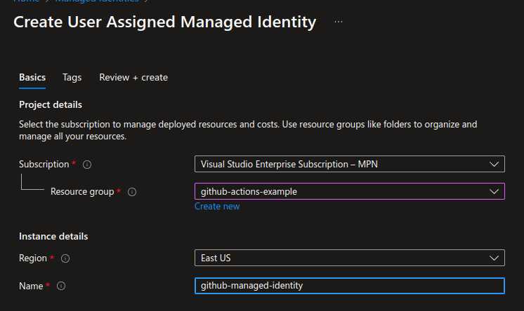
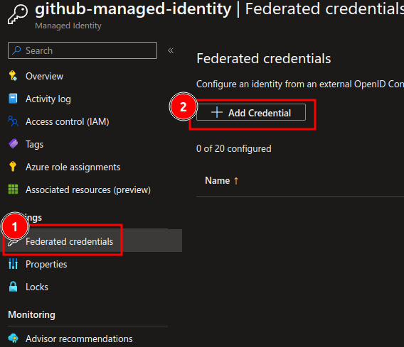
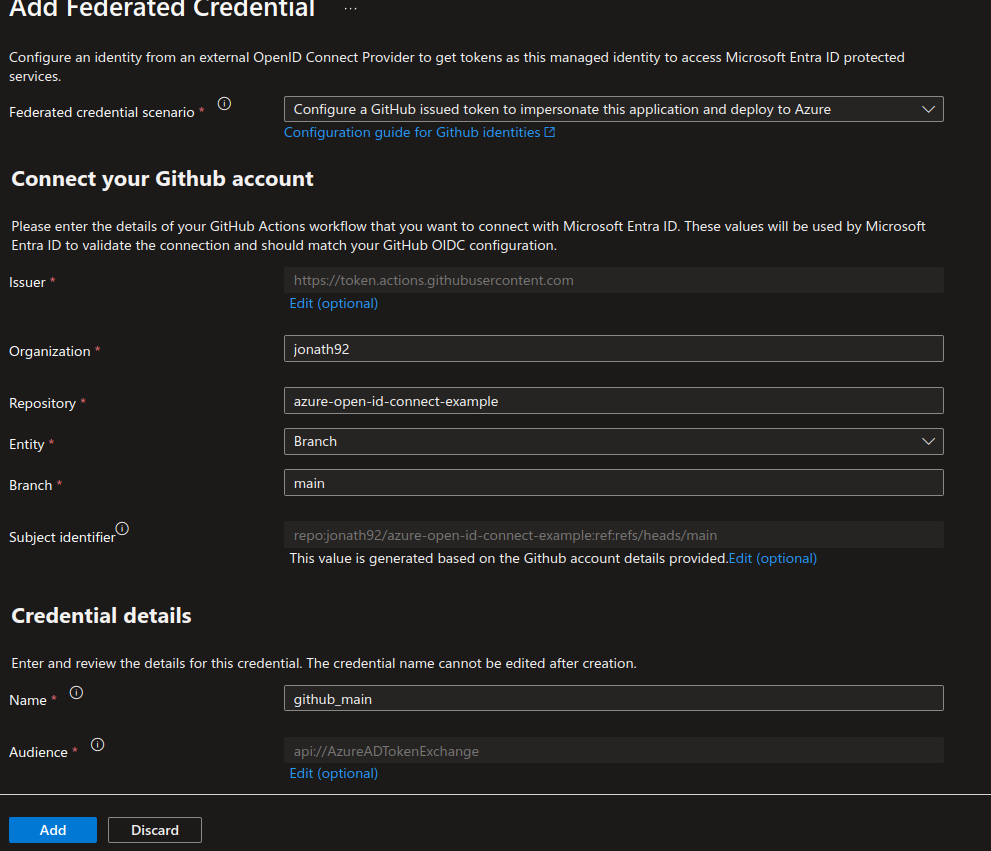
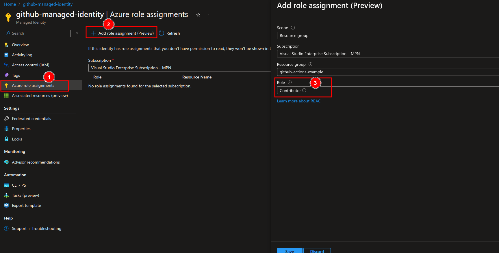

# About
Example showing how to connect from a GitHub Workflow to Azure with OpenId Connect (OIDC) using a managed identity. 

# Prerequisites

- A Created Azure Container registry without an user-assigned identity (this is done in the Demo)
- Provided Secrets

# Demo
## Introduction

The repository contains a gitHub workflow which is triggered by pushes to the main branch or manually in the UI and a simple Dockerfile which uses a simple bash script. 

## Show initial state
Go to the Example Workflow in the gui and trigger the workflow. It should fail. Show the error message. 

## Add Managed Identiy to Azure
- Go to portal.azure.com
- Add a Managed Identity

- Go to created resource and copy the Client ID and replace it with the GitHub Secret 
- Trigger the Workflow again. It should again fail but this time with another error: 
  > Client application has no configured federated identity credentials.

## Add Federated Identity
- Go to resource in the azure portal and select "Federated credentials" + "Add Credential" 
 
- Fill out the values and click "Add" 

- Trigger the pipeline again. Now there should be another error. 

## Add Role Asignment
- Got to "Azure role assignments" and add a Role "Contributor"

- Trigger the pipeline again. Now it should work :smiley:

# Resources
- [GitHub Permission Setting with OpenId Connect](https://docs.github.com/en/actions/deployment/security-hardening-your-deployments/configuring-openid-connect-in-azure#adding-permissions-settings)
- [Configure a user-assigned managed identity to trust an external identity provider](https://learn.microsoft.com/en-us/entra/workload-id/workload-identity-federation-create-trust-user-assigned-managed-identity?pivots=identity-wif-mi-methods-azp)

# Limits
- Azure Federated credentials don't support wildcards, see: https://github.com/Azure/azure-workload-identity/issues/373. 